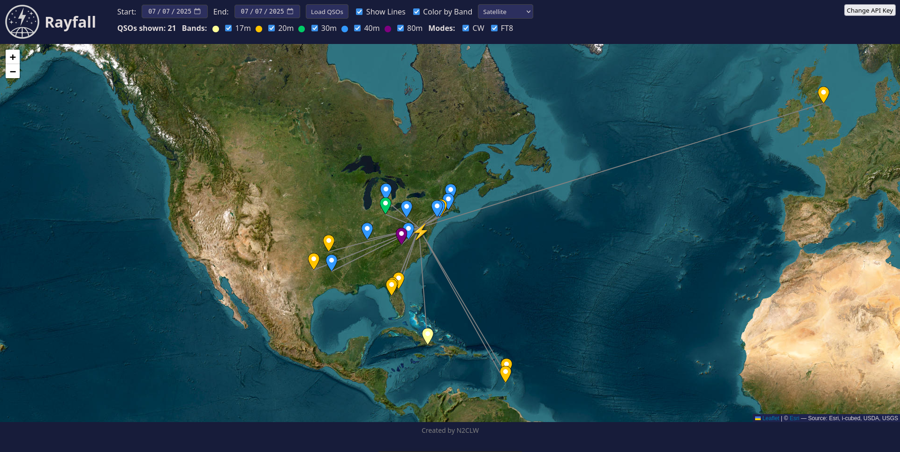

#

<p align="center">
  
</p>

# Rayfall: QRZ Logbook Map Viewer

Rayfall is a dynamic ham radio mapping interface that pulls your logbook data from QRZ and plots your QSOs on an interactive Leaflet map. You can explore contacts by date range, filter by band and mode, and visually analyze your contacts across different locations and timeframes.

> **Built by N2CLW**

---

## Features

* **Interactive Leaflet Map**
* **Supports multiple QRZ logbooks**
* **Date range selection**
* **Color-coded pins by band**
* **Map lines to QSOs (toggle on/off)**
* **Custom icon for your QTH**
* **Filter QSOs by band and mode**
* **Auto-reads your QTH from log data**
* **Client-side QRZ API Key entry (no hardcoding required)**

---

## Screenshot



---

## Installation

### Prerequisites

* Python 3.11+
* pip
* Git

### 1. Clone the Repository

```bash
git clone https://github.com/yourusername/rayfall.git
cd rayfall
```

### 2. Set Up a Virtual Environment

```bash
python3 -m venv venv
source venv/bin/activate  # On Windows: venv\Scripts\activate
```

### 3. Install Dependencies

```bash
pip install -r requirements.txt
```

> **Note:** Required packages include FastAPI, uvicorn, and Jinja2. You can also install them manually:

```bash
pip install fastapi uvicorn jinja2
```

### 4. Start the Server

```bash
uvicorn main:app --reload
```

This starts the server locally at: `http://127.0.0.1:8000`

---

## Usage Instructions

1. Visit `http://127.0.0.1:8000` in your browser.
2. Click the **"Change API Key"** button in the top-right.
3. Paste in your **QRZ Logbook API key** and click **Save**.
4. Choose a start and end date and click **Load QSOs**.
5. Filter contacts by band/mode and enable map lines as desired.

All contacts with grid and lat/lon information will be plotted.

> ✅ You can switch logbooks anytime by clicking the API Key button again.

---

## QRZ API Key Info

Rayfall **does not store your API key on a server**. Instead:

* It saves it to `localStorage` in your browser.
* The backend reads the key from request headers.
* No secret is ever exposed in the source code.

> 🔐 This makes it safe to share or host this code publicly.

To generate a QRZ Logbook API Key:

1. Go to [https://logbook.qrz.com/](https://logbook.qrz.com/)
2. Click on **Settings > API**
3. Copy your unique API key

---

## Customization

### Change the Default Map Location

Rayfall centers on VA by default. Once a valid log is loaded, it updates to your actual QTH using your first valid `my_lat` and `my_lon` from the QRZ logs.

If you'd like to hardcode a default starting location, edit:

```js
map = L.map('map').setView([XXX, XXX], 4);
```


### Styling

Edit the styles directly in the `<style>` block inside `index.html`. All controls and map elements can be styled using standard CSS.

---

## Directory Structure

```
rayfall/
├── main.py                 # FastAPI backend
├── templates/
│   └── index.html          # Frontend map UI
├── static/
│   ├── rayfall.png         # Logo
│   └── screenshot.png      # Screenshot
├── requirements.txt        # Python dependencies
└── README.md               # You're reading this
```

---


## Contributing

Pull requests and forks are welcome! If you find a bug or want to suggest a feature, feel free to open an issue or PR.

---

## License

This project is open source and available under the MIT License.

---

## Created by

**Chris Williams (N2CLW)**

* [qrz.com/db/N2CLW](https://www.qrz.com/db/N2CLW)
* [github.com/moose25](https://github.com/moose25)

---

> 73 and happy DXing!
