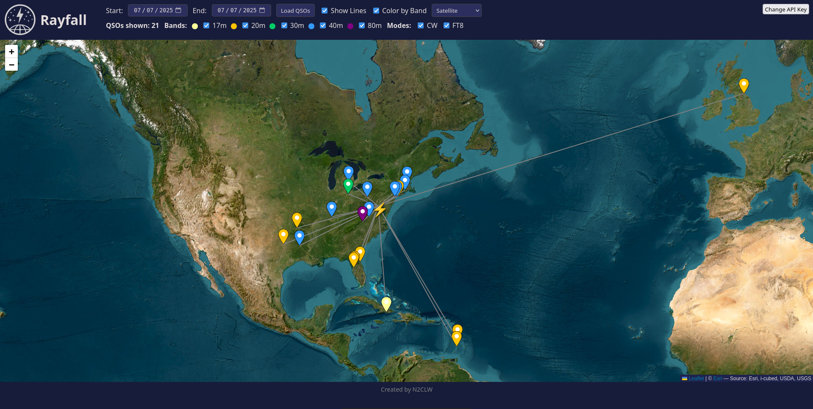

#

<p align="center">
  
</p>

# Rayfall: QRZ Logbook Map Viewer

Rayfall is a dynamic ham radio mapping interface that pulls your logbook data from QRZ and plots your QSOs on an interactive Leaflet map. You can explore contacts by date range, filter by band and mode, and visually analyze your contacts across different locations and timeframes.

> **Built by N2CLW**

## Available at [rayfall.me](https://rayfall.me)
---

## Features

* **Interactive Leaflet Map**
* **Multiple import methods:**
  * QRZ API integration (supports multiple logbooks)
  * **NEW:** ADI/ADIF file import (no API key required!)
* **Date range selection**
* **Color-coded pins by band or by QTH**
* **Multi-QTH support:** logs that span multiple locations (travel, POTA, Field Day) get a separate marker per QTH, plus a QTH filter row and per-QSO "From QTH" info
* **Customizable display options:**
  * Multiple pin icon styles (teardrop, circle, square, star)
  * QTH station icons: clean shapes (dot, plus, square, signal) or emoji, with a color picker and optional grid label
  * Custom grid square colors and opacity
  * Multiple basemap styles
* **Grid square overlay with 4/6-character precision**
* **Map lines from each QTH to its QSOs (toggle on/off)**
* **Filter QSOs by band, mode, or originating QTH**
* **High-resolution map export (300 DPI for printing)**
* **Auto-reads your QTH(s) from log data** (`MY_GRIDSQUARE`, `MY_LAT`/`MY_LON`)
* **Clean dropdown menu for display options**
* **Works offline with ADI files**

---

## Screenshot



---

## Installation

### Prerequisites

* Python 3.11+
* pip
* Git

### 1. Clone the Repository

```bash
git clone https://github.com/moose25/rayfall.git
cd rayfall
```

### 2. Set Up a Virtual Environment

```bash
python3 -m venv venv
source venv/bin/activate  # On Windows: venv\Scripts\activate
```

### 3. Install Dependencies

```bash
pip install -r requirements.txt
```

> **Note:** Required packages include FastAPI, uvicorn, and Jinja2. You can also install them manually:

```bash
pip install fastapi uvicorn jinja2
```

### 4. Start the Server

```bash
uvicorn main:app --reload
```

This starts the server locally at: `http://127.0.0.1:8000`

---

## Usage Instructions

### Getting Started

**New users?** Click the **"📖 How to Use Rayfall"** button (top-right) for interactive tutorials!

### Method 1: QRZ API (Online)

1. Visit `http://127.0.0.1:8000` in your browser.
2. Click the **"Change API Key"** button in the top-right.
3. Paste in your **QRZ Logbook API key** and click **Save**.
4. Choose a start and end date and click **Load from QRZ**.
5. Filter contacts by band/mode and customize display options.

### Method 2: ADI File Import (Offline) 🆕

1. Visit `http://127.0.0.1:8000` in your browser.
2. Click **"Import ADI File"** and select your `.adi` or `.adif` file.
3. Your QSOs load instantly - no API key needed!
4. Filter contacts by band/mode and customize display options.

**See [QUICK_START_ADI.md](QUICK_START_ADI.md) for detailed ADI import guide.**

### Display Customization 🆕

Click the **"⚙️ Display Options"** button to access:
- **Map Style**: Light, Dark, Topographic, Satellite, Streets
- **QTH Icon**: Clean shapes (Dot, Plus, Square, Signal) or emoji, with a color picker and optional grid label under each marker
- **Color Pins by QTH**: color every contact by the QTH it was made from (great for multi-location trips)
- **Pin Style**: Teardrop, Circle, Square, or Star markers
- **Grid Squares**: Custom colors, opacity, and precision (4 or 6 chars)

All contacts with grid squares or lat/lon information will be plotted.

### Need Help?

The **"📖 How to Use Rayfall"** button provides:
- Step-by-step setup instructions
- ADI import guide for all major logging software
- Display customization tutorials
- Filtering and export tips
- Pro tips for advanced usage

> ✅ You can switch logbooks anytime by clicking the API Key button again.

---

## QRZ API Key Info

Rayfall **does not store your API key on a server**. Instead:

* It saves it to `localStorage` in your browser.
* The backend reads the key from request headers.
* No secret is ever exposed in the source code.

> 🔐 This makes it safe to share or host this code publicly.

To generate a QRZ Logbook API Key:

1. Go to [https://logbook.qrz.com/](https://logbook.qrz.com/)
2. Click on **Settings > API**
3. Copy your unique API key

---

## Customization

### Change the Default Map Location

Rayfall centers on VA by default. Once a valid log is loaded, it updates to your actual QTH using the first valid `MY_LAT`/`MY_LON` (or the centre of `MY_GRIDSQUARE`) from the log. Logs that span multiple QTHs will show one marker per location.

If you'd like to hardcode a default starting location, edit:

```js
map = L.map('map').setView([XXX, XXX], 4);
```


### Styling

Edit the styles directly in the `<style>` block inside `index.html`. All controls and map elements can be styled using standard CSS.

---

## Directory Structure

```
rayfall/
├── main.py                 # FastAPI backend
├── templates/
│   └── index.html          # Frontend map UI
├── static/
│   ├── rayfall.png         # Logo
│   └── screenshot.png      # Screenshot
├── requirements.txt        # Python dependencies
└── README.md               # You're reading this
```

---


## Contributing

Pull requests and forks are welcome! If you find a bug or want to suggest a feature, feel free to open an issue or PR.

---

## License

This project is open source and available under the MIT License.

---

## Created by

**Chris Williams (N2CLW)**

* [qrz.com/db/N2CLW](https://www.qrz.com/db/N2CLW)
* [github.com/moose25](https://github.com/moose25)

---

> 73 and happy DXing!
